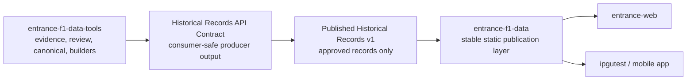

# Published Historical Records Contract v1

Schema version: `published-historical-records.v1`

Status: publication contract only; no historical records are published by
Phase 9A.

## Purpose

This contract defines the only historical-record shape that may be published
by `entrance-f1-data`. It accepts the consumer-safe API output prepared by
`entrance-f1-data-tools` only after all producer and publication gates pass.

This repository does not interpret evidence, review packets, builder state, or
canonical records. Those remain exclusively in `entrance-f1-data-tools`.

## Publication boundary



Promotion is manual and separately approved. Phase 9A creates only the schema
and documentation; it creates no dataset and modifies no production JSON.

## Required sections

Every future published dataset must contain:

- `schemaVersion`: `published-historical-records.v1`
- `apiVersion`: semantic public API version
- `generatedAt`: frozen UTC ISO 8601 publication timestamp
- `generatedFrom`: producer contract identity, checksum, and producer
  attestation
- `metadata`: dataset identity, as-of date, counts, consumers, and minimum
  consumer version
- `readiness`: dataset-level readiness and production eligibility
- `publicationStatus`: explicit publication approval and approval reference
- `records`: fully approved records only

The authoritative schema is:

```text
schemas/published-historical-records.v1.schema.json
```

## Publication rules

A historical record may enter a published dataset only after the producer has
proved all of the following internally:

- `productionEligible=true`
- publication approval exists
- canonical approval exists
- review is complete

The producer represents those internal checks with the single public
attestation `all_required_gates_passed`. `entrance-f1-data` validates that
attestation but does not receive or interpret the underlying evidence, review,
builder, or canonical metadata.

The published schema additionally requires:

- `publicationStatus.state=published`
- `publicationStatus.publicationApproved=true`
- dataset-level `ready=true`
- dataset-level `blocked=false`
- every record has `productionEligible=true`
- every record has `confidence=verified`

## Blocked and provisional data

Blocked records are omitted completely. They must not appear as:

- null records;
- placeholder records;
- provisional holder values;
- blocker objects;
- record-level readiness objects.

The schema requires at least one eligible record. When zero records are
eligible, no `published-historical-records.v1` dataset file is created. An
empty production-looking JSON file is not used as a placeholder.

## Consumer compatibility

`entrance-web` and `ipgutest` consume the same versioned static file. A v1
consumer must:

- select only record IDs it supports;
- ignore unknown record IDs;
- ignore unknown optional fields;
- treat missing optional fields as absent;
- reject an unsupported major API version.

Consumers never fetch evidence, review state, canonical files, or data-tools
outputs directly.

## Future and backward compatibility

Within major version 1:

- existing record IDs retain their meaning and are never reassigned;
- new record IDs are additive;
- new optional fields are additive;
- existing required field types and meanings remain stable.

Removing or renaming required fields, reassigning record IDs, weakening the
publication gates, or changing field semantics requires a new major version.
A future v2 should remain available alongside v1 during consumer migration
whenever practical.

## Deterministic publication

`generatedAt`, the publication approval reference, producer artifact checksum,
and all record values are frozen publication inputs. The publisher must not
replace `generatedAt` with the current clock during a repeat build. Identical
approved inputs serialized as canonical UTF-8 JSON with sorted keys must
produce identical bytes.

## Phase 9A validation

Phase 9A validates the schema with synthetic in-memory data only. It verifies:

- a fully eligible record is accepted;
- empty, blocked, provisional, null-holder, ineligible, and unapproved
  publication payloads are rejected;
- additive optional fields and future record IDs remain v1-compatible;
- unsupported major versions fail closed;
- repeated canonical serialization is byte-identical;
- existing production JSON and Stats Lab candidate files remain unchanged.

No synthetic or historical record payload is written into this repository.
